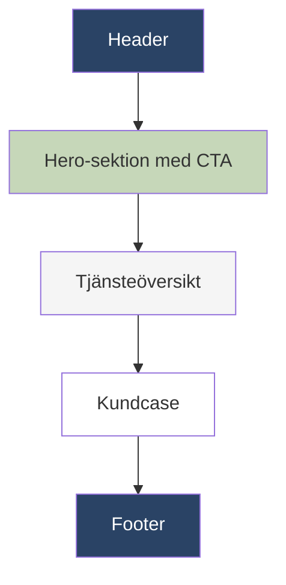
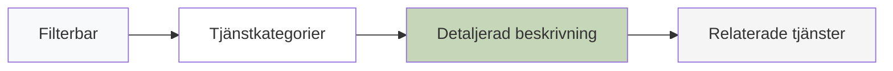
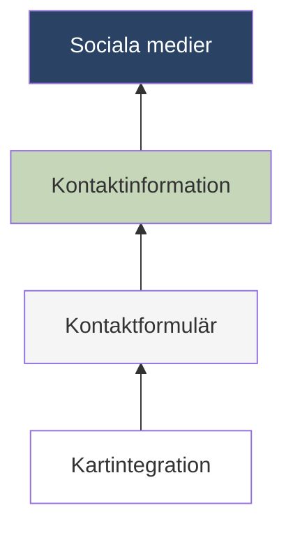

# Wireframes

## Startsida

**Key components:**
- Responsiv navigeringsmeny med dropdown
- Hero-sektion med huvudbudskap (h1 + kort beskrivning)
- 3-kolumns tjänsteöversikt med ikoner
- Kundcitat-carousel
- Footer med kontaktinfo och snabblänkar

## Tjänstersida

**Funktionalitet:**
- Interaktivt filter för tjänstkategorier
- Expandable panels för detaljinformation
- Hover-effekter på tjänstkort
- Progressivt inladdade bilder

## Kontaktsida

**Integreringar:**
- Google Maps API med markörer
- Formulär med reCAPTCHA-validering
- Dynamisk adressvisning baserat på geolokalisering
- Social media ikoner med hover-transition
